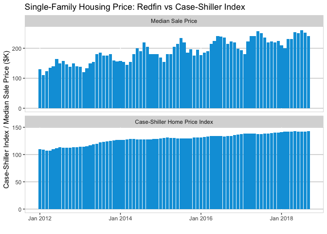

Predict Case-Shiller Home Price Index (Chicago)
================

Motivation
==========

**Question** Can we use a real-time selected sample to predict the overall market trend?
Redfin data center provides monthly real estate information of houses listed on their website. The data are updated each month. On the other hand, Case-Shiller Home Price Index measures the value of the residential real estate and is reported with two month lag. Redfin data are an almost real-time selected sample while case-Shiller Home Price Index is a general survey with lags.

Data Preprocessing
==================

This exercise uses Case-Shiller Home Price Index of Chicago downloaded from FRED database using *quantmod* package and Redfin single-family home listing data download from [Redfin Data Center](https://www.redfin.com/blog/data-center).

``` r
# data preprocessing
require(quantmod)
```

    ## Loading required package: quantmod

    ## Loading required package: xts

    ## Loading required package: zoo

    ## 
    ## Attaching package: 'zoo'

    ## The following objects are masked from 'package:base':
    ## 
    ##     as.Date, as.Date.numeric

    ## 
    ## Attaching package: 'xts'

    ## The following objects are masked from 'package:dplyr':
    ## 
    ##     first, last

    ## Loading required package: TTR

    ## Version 0.4-0 included new data defaults. See ?getSymbols.

``` r
require(zoo)
# download case-shiller housing price index Chicago seasonally adjusted
getSymbols('CHXRSA', src='FRED')
```

    ## 'getSymbols' currently uses auto.assign=TRUE by default, but will
    ## use auto.assign=FALSE in 0.5-0. You will still be able to use
    ## 'loadSymbols' to automatically load data. getOption("getSymbols.env")
    ## and getOption("getSymbols.auto.assign") will still be checked for
    ## alternate defaults.
    ## 
    ## This message is shown once per session and may be disabled by setting 
    ## options("getSymbols.warning4.0"=FALSE). See ?getSymbols for details.

    ## [1] "CHXRSA"

``` r
# ================================
# load redfin data
rfDf <- subset(redfin, Region == "Chicago, IL", select = c("Month.of.Period.End", "Median.Sale.Price", "Homes.Sold", "New.Listings", "Inventory", "Days.on.Market", "Average.Sale.To.List"))

rfDf$Month.of.Period.End <- as.yearmon(rfDf$Month.of.Period.End)
# process strings into numbers
rfDf$New.Listings <- as.numeric(gsub(",", "", rfDf$New.Listings))
rfDf$Inventory <- as.numeric(gsub(",", "", rfDf$Inventory))
rfDf$Median.Sale.Price <- as.numeric(gsub("\\D", "", rfDf$Median.Sale.Price)) * 1000
rfDf$Average.Sale.To.List <- as.numeric(gsub("\\D", "", rfDf$Average.Sale.To.List)) * 0.001
```

``` r
require(ggplot2)
df <- as.data.frame(CHXRSA)
df$mon <- as.yearmon(row.names(df))

pltDf <- merge(df, rfDf, by.x = "mon", by.y = "Month.of.Period.End")

p1 <- ggplot(pltDf, aes(x = mon, y = Median.Sale.Price/1000)) + geom_bar(stat = "identity", fill = "#00a0dc") + expand_limits(y = 0) + scale_x_yearmon(breaks =  scales::pretty_breaks(n = 4)) + xlab("") + ylab("Median Sale Price ($K)") + theme(
  panel.background = element_blank(),
  panel.grid.major.y = element_line(colour = "grey80"),
  panel.border = element_rect(colour = "grey80", fill = NA)
) + ggtitle("RedFin Single-Family Housing Sale Price")
print(p1)
```



GitHub Documents
----------------

This is an R Markdown format used for publishing markdown documents to GitHub. When you click the **Knit** button all R code chunks are run and a markdown file (.md) suitable for publishing to GitHub is generated.

Including Code
--------------

You can include R code in the document as follows:

``` r
summary(cars)
```

    ##      speed           dist       
    ##  Min.   : 4.0   Min.   :  2.00  
    ##  1st Qu.:12.0   1st Qu.: 26.00  
    ##  Median :15.0   Median : 36.00  
    ##  Mean   :15.4   Mean   : 42.98  
    ##  3rd Qu.:19.0   3rd Qu.: 56.00  
    ##  Max.   :25.0   Max.   :120.00

Including Plots
---------------

You can also embed plots, for example:


Note that the `echo = FALSE` parameter was added to the code chunk to prevent printing of the R code that generated the plot.
