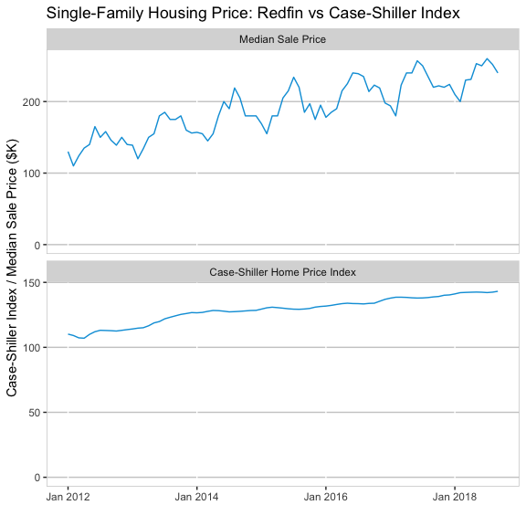

Predict Case-Shiller Home Price Index (Chicago)
================

Motivation
==========

**Question** Can we use a real-time selected sample to predict the overall market trend?
Redfin data center provides monthly real estate information of houses listed on their website. The data are updated each month. On the other hand, Case-Shiller Home Price Index measures the value of the residential real estate and is reported with two month lag. Redfin data are an almost real-time selected sample while case-Shiller Home Price Index is a general survey with lags.

Data Preprocessing
==================

This exercise uses Case-Shiller Home Price Index of Chicago downloaded from FRED database using *quantmod* package and Redfin single-family home Chicago listing data downloaded from [Redfin Data Center](https://www.redfin.com/blog/data-center).

``` r
# data preprocessing
require(quantmod)
require(zoo)
# download case-shiller housing price index Chicago seasonally adjusted
getSymbols('CHXRSA', src='FRED')
```

    ## [1] "CHXRSA"

``` r
# ================================
# load redfin data
rfDf <- subset(redfin, Region == "Chicago, IL", select = c("Month.of.Period.End", "Median.Sale.Price", "Homes.Sold", "New.Listings", "Inventory", "Days.on.Market", "Average.Sale.To.List"))

rfDf$Month.of.Period.End <- as.yearmon(rfDf$Month.of.Period.End)
# process strings into numbers
rfDf$New.Listings <- as.numeric(gsub(",", "", rfDf$New.Listings))
rfDf$Inventory <- as.numeric(gsub(",", "", rfDf$Inventory))
rfDf$Median.Sale.Price <- as.numeric(gsub("\\D", "", rfDf$Median.Sale.Price))
rfDf$Average.Sale.To.List <- as.numeric(gsub("\\D", "", rfDf$Average.Sale.To.List)) * 0.001
```

Data Visualization
==================

The following graphic shows the median sale price on Redfin and the Case-Shiller Index. Between Jan 2012 and Sep 2018, Case-Shiller index increases around 29% while the median sale price increases around 85%. This result implies that Redfin data may not be an representative sample of the Chicago housing market for reasons such as: Redfin expanded their representation overtime - therefore, the changes in Redfin's price not only capture the changes of the market but also the changes of Redfin's business itself.



Empirical Strategy: Linear Model with ARIMA Error
=================================================

We can think of Case-Shiller index as a function of Redfin data where the disturbance term captures the changes in Redfin's business. This assumption implies the use of the ARIMAX model, where we allow the disturbance term to have AR or MA structure.

``` r
modDf <- merge(df, rfDf, by.x = "mon", by.y = "Month.of.Period.End")
modDf$logCHXRSA <- log(modDf$CHXRSA)
modDf$logmsp <- log(modDf$Median.Sale.Price)
```

Use Hyndman-Khandakar algorithm to determine the order:

``` r
require(forecast)
```

    ## Loading required package: forecast

``` r
fit <- auto.arima(modDf$logCHXRSA, xreg = modDf$logmsp, allowdrift = T)
summary(fit)
```

    ## Series: modDf$logCHXRSA 
    ## Regression with ARIMA(2,1,2) errors 
    ## 
    ## Coefficients:
    ##          ar1      ar2      ma1     ma2   drift     xreg
    ##       0.7906  -0.6291  -0.0460  0.3966  0.0035  -0.0112
    ## s.e.  0.2298   0.1909   0.2604  0.1857  0.0008   0.0045
    ## 
    ## sigma^2 estimated as 2.209e-05:  log likelihood=318.43
    ## AIC=-622.85   AICc=-621.3   BIC=-606.18
    ## 
    ## Training set error measures:
    ##                         ME        RMSE         MAE          MPE     MAPE
    ## Training set -6.216907e-06 0.004492621 0.003146538 8.141297e-05 0.065304
    ##                   MASE        ACF1
    ## Training set 0.6344225 -0.02725734

The algorithm suggests a regression with arima(2, 1, 2) error:

*Δ**y*<sub>*t*</sub> = *β*<sub>0</sub> + *β*<sub>1</sub>*Δ**x*<sub>*t*</sub> + *u*<sub>*t*</sub>

*u*<sub>*t*</sub> = *ρ*<sub>1</sub>*u*<sub>*t* − 1</sub> + *ρ*<sub>2</sub>*u*<sub>*t* − 2</sub> + *ϵ*<sub>*t*</sub> + *γ*<sub>1</sub>*ϵ*<sub>*t* − 1</sub> + *γ*<sub>2</sub>*ϵ*<sub>*t* − 2</sub>

*ϵ*<sub>*t*</sub> ∼ *N*(0, *σ*)

By iteratively replacing *y*<sub>*t*</sub> with previous *y*<sub>*t*</sub>, the model can be rewritten as:

*y*<sub>*t*</sub> = *y*<sub>0</sub> + *β*<sub>0</sub> ⋅ *t* + *β*<sub>1</sub>(*x*<sub>*t*</sub> − *x*<sub>0</sub>)+∑<sub>*j*</sub>*u*<sub>*j*</sub>

Residual Diagnostics
--------------------

I implement the Box-Ljung Test to test whether the residuals are white noises.

``` r
# Box-Ljung Serial Correlation Test
Box.test(resid(fit)) # Pass!
```

    ## 
    ##  Box-Pierce test
    ## 
    ## data:  resid(fit)
    ## X-squared = 0.06018, df = 1, p-value = 0.8062

Cross-Validation
----------------

Cross-validation is conducted by estimating training data with 60 months and predict the next three month.

``` r
out <- rep(0, nrow(modDf) -3 - 60 + 1)
for(k in 60:(nrow(modDf) - 3)) {
    train <- modDf[(k-59):k, ]
    test <- modDf[(k+1):(k+3), ]
    mod <- Arima(train$logCHXRSA, xreg = train$logmsp, 
                 order = c(2, 1, 2), 
                 seasonal = list(period = 1, order = c(0, 0, 0)), 
                 include.drift  =T) 
    pred <- modDf$logCHXRSA[1] + coef(mod)['drift'] * ((k + 1):(k + 3)) + coef(mod)['train$logmsp'] * (test$logmsp - modDf$logmsp[1])
    # use y0 + b0 * t + b1 * (xt - x0) to handle drift
    out[k-59] <- mean((pred - test$logCHXRSA)^2)
}
print(paste("rmse:", round(mean(out), 4)))
```

    ## [1] "rmse: 0.001"

The root mean squared logarithm error of this model is 0.001.

``` r
train <- modDf[1:(nrow(modDf) - 12), ]
test <- modDf[((nrow(modDf) - 11) : nrow(modDf)), ]
fit <- Arima(train$logCHXRSA, xreg = train$logmsp, 
             order = c(2, 1, 2), 
             seasonal = list(period = 1, order = c(0, 0, 0)), 
             include.drift  =T) 
pred <- modDf$logCHXRSA[1] + coef(mod)['drift'] * (((nrow(modDf) - 11) : nrow(modDf))) + coef(mod)['train$logmsp'] * (test$logmsp - modDf$logmsp[1])
ggplot(melt(subset(cbind(test, pred), select = c("mon", "logCHXRSA", "pred")), id = "mon"), aes(x = as.Date(mon), y = value)) + geom_line(aes(colour = variable)) + theme(
  panel.background = element_blank(),
  panel.grid.major.y = element_line(colour = "grey80"),
  panel.border = element_rect(colour = "grey80", fill = NA)
) + xlab("Month") + ylab("Actual vs Predicted Case-Shiller") + ggtitle("12-Month Out-of-Sample Testing")
```


